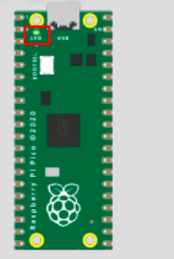

# Practica1 LED PIN 

#LED PIN  
import board  
import digitalio  
import time  
#import machine  
  
led = digitalio.DigitalInOut(board.LED)  
led.direction = digitalio.Direction.OUTPUT  
  
while True:  
     led.value = not led.value  
     time.sleep(0.5)  
     import board  

